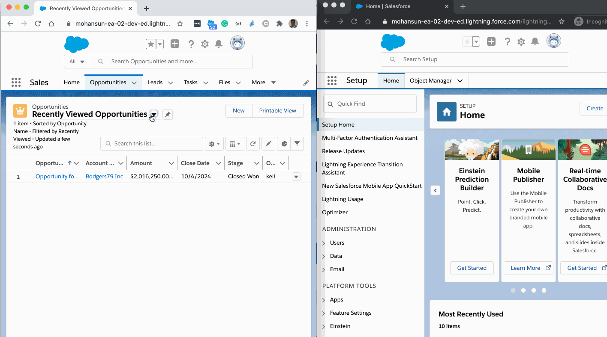

# Pinning a List View 
## Issue
- System not persisting the pinning state at the backend
### Reproduce
- Open the Org in both incognito and normal Chrome browser
- Update the list view pinning in one browser and refresh another browser to check the pinning persistence
- You will see it is cached at client side but **not persisted** at the backend.

### Demo

